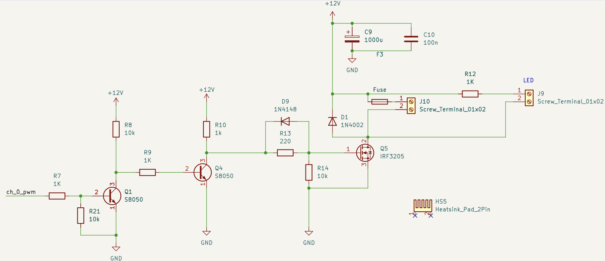
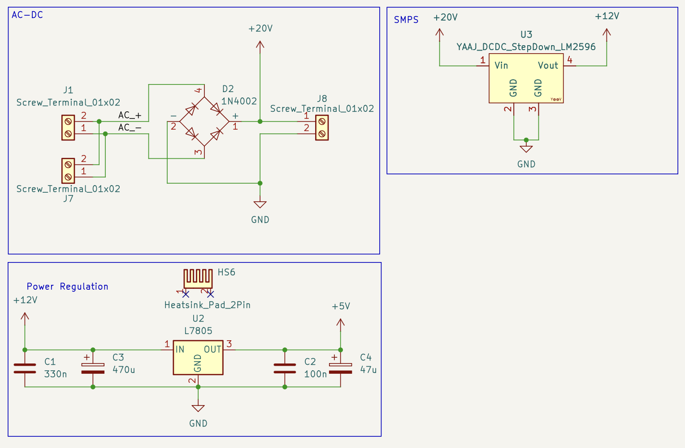

# Train Driver Hardware

Hardware design files for the Train Driver project.

## Overview

This repository currently contains the KiCad project and schematic for a simple MCU-based circuit intended to drive two PWM-controlled trains.

A STM32F103C8T6 Blue Pill is used as the main controller, reading two potentiometers and then running two FET drivers via PWM.

A snippet of the  transister driver circuit is shown below:

A full bridge rectifier is also used, to which a snippet is also shown below:

## Falstad Simulation

[Falstad](https://www.falstad.com/circuit/circuitjs.html) was also used to simulate parts of the circuit, the simulations can be found in `.txt` format in the [simulations](./simulations/) folder/

## Bill of Materials

The Bill of Materials can be found in the GitHub releases, which is created automatically by the [Kicad GitHub Actions workflow](./.github/workflows/kicad.yaml).

## Useful Links

- [Firmware](https://github.com/ScottGibb/Train-Driver-Firmware?tab=readme-ov-file)
